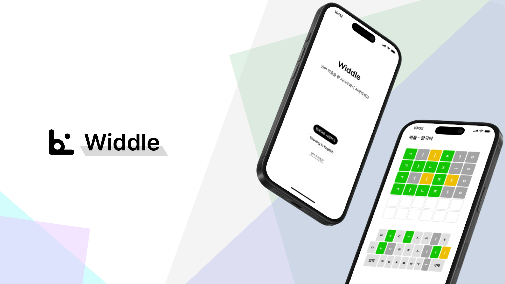

# Widdle

> 단어 퀴즈 게임! 매일 갱신되는 새로운 단어를 맞춰보세요!

 

## 프로젝트 소개

### 🗓️ 기간

- 25.08.13 ~ <i>PRESENT</i>

### ⚙️ 기술 스택

#### Frontend

 

#### Backend

    

#### Infra

    

 

### 📱 소개

 

### ⚙️ System Architecture

